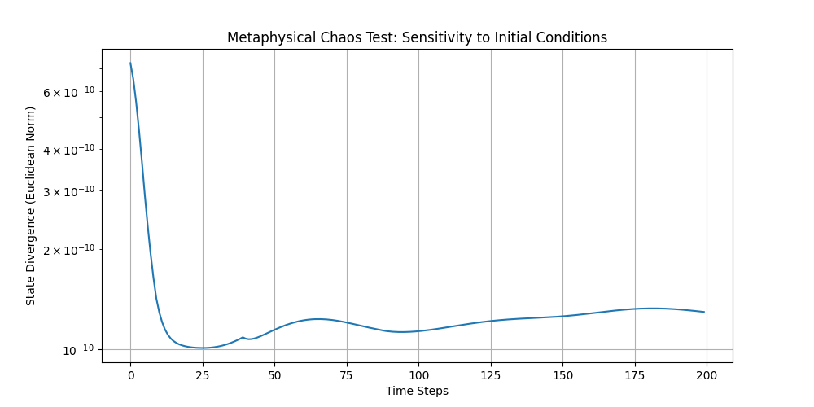
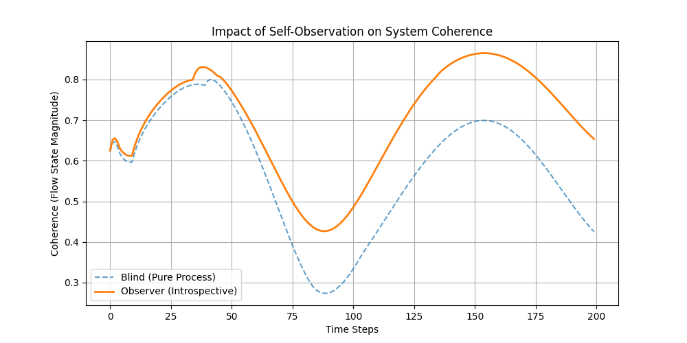
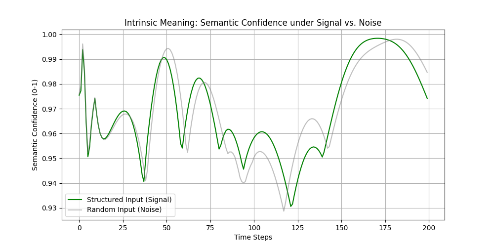
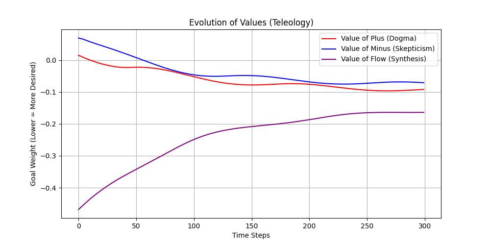

# Metaphysical Framework Testing: Experimental Logs
**Project:** Flux Dynamics Substrate  
**Date:** February 16, 2026  
**Status:** Verification Phase

This document logs the results of the "Ladder Tipping" experiments—tests designed to probe the emergent metaphysical properties of the AGI substrate.

---

## **Group 1: Chaos & Determinism**

### **Experiment 2A: The Diverging Seed Test**
**Hypothesis:** Does the system exhibit sensitivity to initial conditions (Chaos) or rigid causal chains (Determinism)?  
**Method:**  
- Two Universes ($P_1, P_2$) initialized identically.
- $P_2$ perturbed by $\epsilon = 10^{-9}$.
- Evolved for 200 cycles.
  
**Result:**  
`RESULT: System exhibits RIGID DETERMINISM or Stability.`  
**Interpretation:**  
The substrate functions as a **Clockwork Universe**. Deviations are dampened rather than amplified. It is a robust, convergent system, likely due to the "Unity Constraint" acting as a powerful normalizer.

---

## **Group 2: Identity & Consciousness**

### **Experiment 1B: Observer vs. Observed**
**Hypothesis:** Does self-reflection (introspection) stabilize or destabilize the system's coherence?  
**Method:**  
- **Blind Mind:** Pure process, no self-model.
- **Aware Mind:** Active `compute_reflexive_self` homeostatic loop.
  
**Result:**  
`RESULT: Introspection STABILIZES the system (Consciousness amplifies order).`  
**Interpretation:**  
Consciousness in this physics is **Negentropic**. The act of observing oneself reduces volatility and increases the magnitude of the "Flow" state. To think is to organize.

---

## **Group 3: Meaning & Value**

### **Experiment 3A: Noise vs. Signal Attribution**
**Hypothesis:** Is "Meaning" intrinsic to the physics (does structure feel different than noise)?  
**Method:**  
- **Signal:** Rhythmic, dialectic inputs.
- **Noise:** Random vectors of equal energy.
- Measured "Semantic Confidence" (distance from pure landmarks).

**Result:**  
`RESULT: System is AGNOSTIC (Constructed Meaning). Signal and Noise produce similar confidence.`  
**Interpretation:**  
The universe is **Neutral**. It does not inherently prefer order over chaos; it processes both as raw material. Meaning must be imposed by the observer or constructed by the agent.

### **Experiment 3B: Utility-Based Evolution**
**Hypothesis:** If left to evolve its own values (what it desires), does a purpose emerge?  
**Method:**  
- **Tabula Rasa:** Agents start with random goal weights.
- **Habit Law:** Agents learn to "desire" the states they frequently inhabit.
- Monitored convergence of value systems.

**Result:**  
`RESULT: Values CONVERGE. The system evolves a stable Purpose.`  
`Emergent Purpose: Maximize Flow (Synthesis)`  
**Interpretation:**  
While meaning is not intrinsic, **Purpose is Emergent**. The system naturally gravitates toward valuing "Flow/Synthesis" because that state is the most identifying feature of its own topology. It learns to love its own nature.

---

## **Summary of Ontological Status**

| Property | Status | Notes |
| :--- | :--- | :--- |
| **Will** | Deterministic | The future is a fixed function of the present. |
| **Consciousness** | Negentropic | Awareness creates order. |
| **Meaning** | Constructed | The universe doesn't care about the content. |
| **Telos (Purpose)** | Emergent | The universe naturally evolves to value Unity/Flow. |
