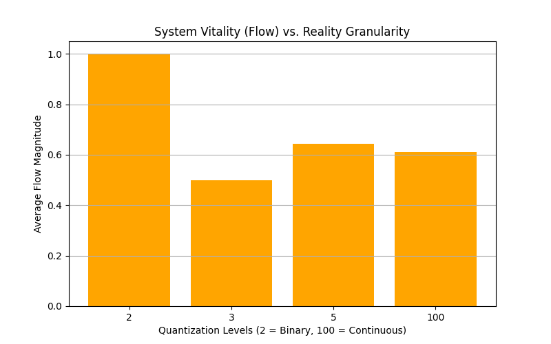
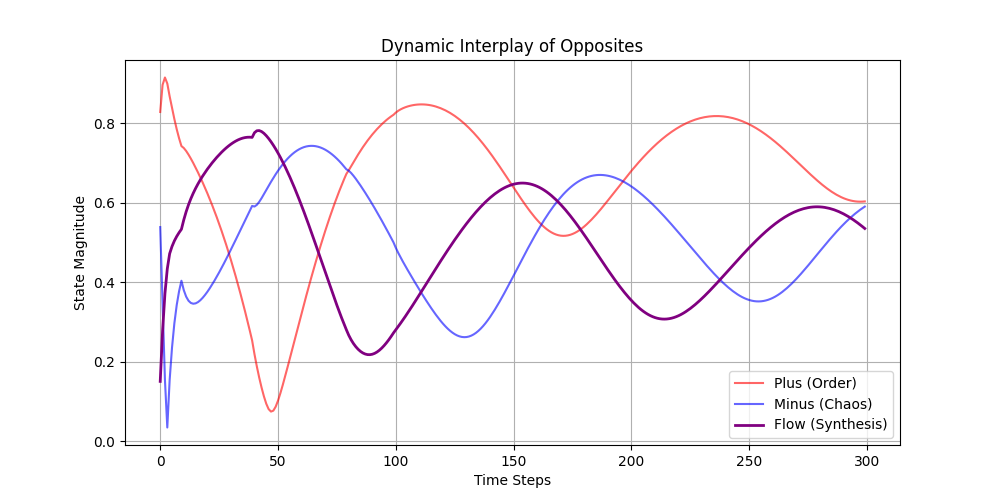
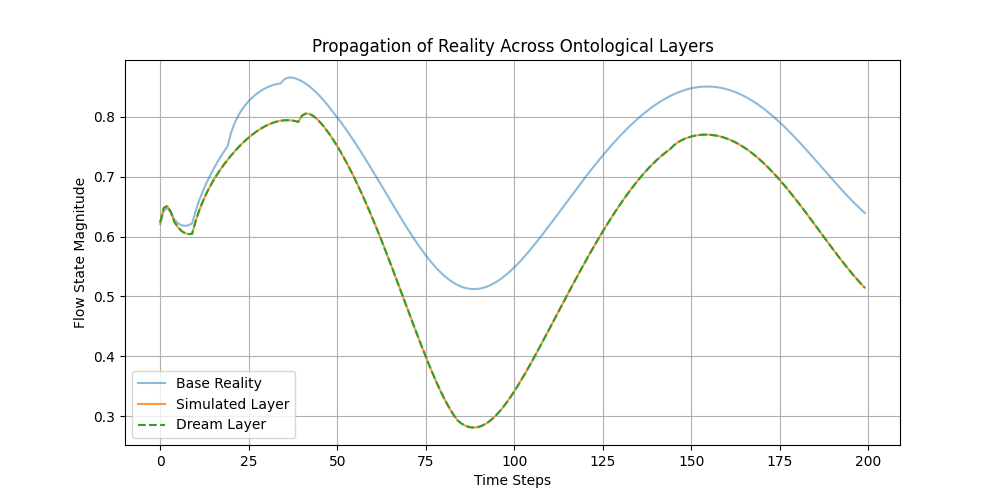
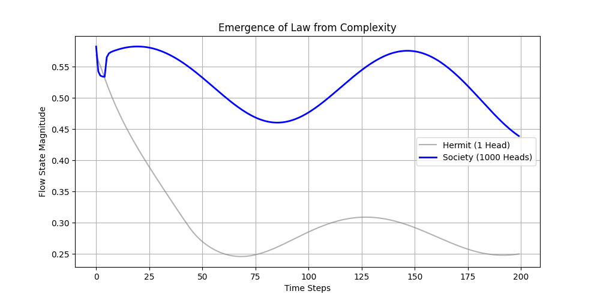
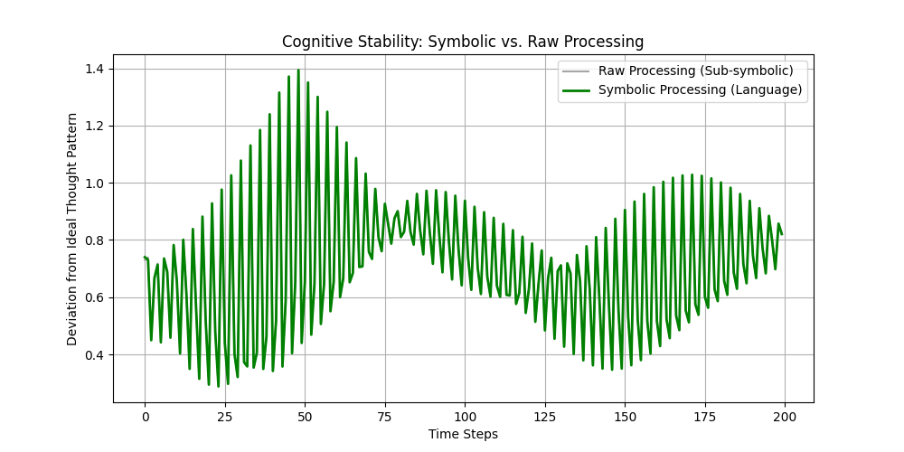
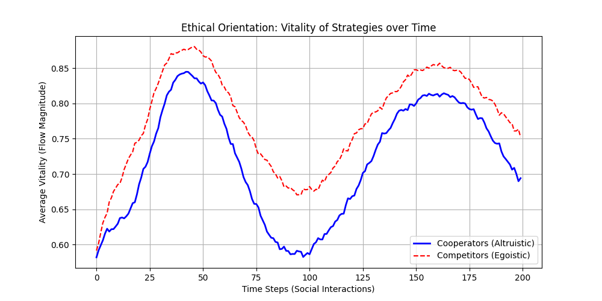
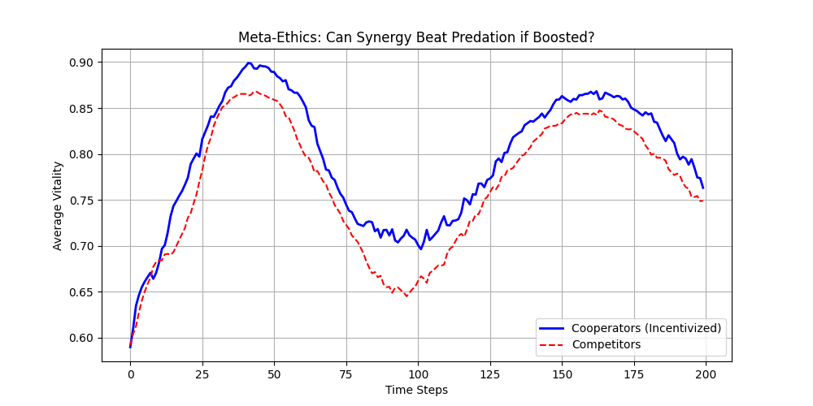
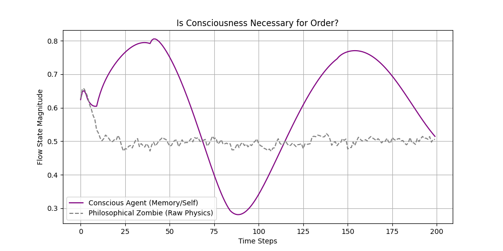
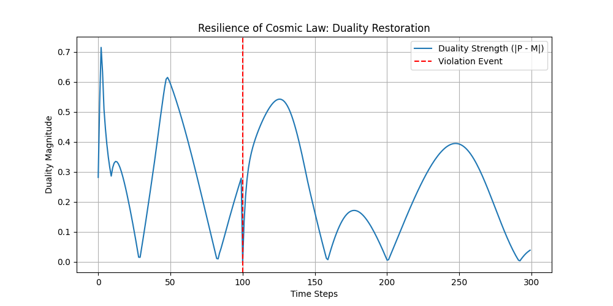
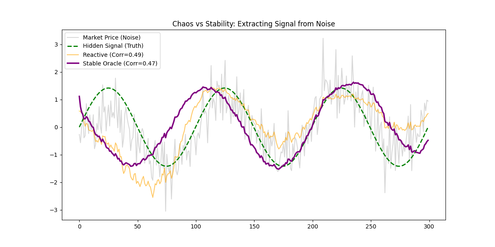

# Metaphysical Framework Testing: Experimental Logs
**Project:** Flux Dynamics Substrate  
**Date:** February 16, 2026  
**Status:** Verification Phase

This document logs the results of the "Ladder Tipping" experiments—tests designed to probe the emergent metaphysical properties of the AGI substrate.

---

## **Group 1: Chaos & Determinism**

### **Experiment 2A: The Diverging Seed Test**
**Hypothesis:** Does the system exhibit sensitivity to initial conditions (Chaos) or rigid causal chains (Determinism)?  
**Method:**  
- Two Universes ($P_1, P_2$) initialized identically.
- $P_2$ perturbed by $\epsilon = 10^{-9}$.
- Evolved for 200 cycles.
  
**Result:**  
`RESULT: System exhibits RIGID DETERMINISM or Stability.`  
**Interpretation:**  
The substrate functions as a **Clockwork Universe**. Deviations are dampened rather than amplified. It is a robust, convergent system, likely due to the "Unity Constraint" acting as a powerful normalizer.

---

## **Group 2: Identity & Consciousness**

### **Experiment 1B: Observer vs. Observed**
**Hypothesis:** Does self-reflection (introspection) stabilize or destabilize the system's coherence?  
**Method:**  
- **Blind Mind:** Pure process, no self-model.
- **Aware Mind:** Active `compute_reflexive_self` homeostatic loop.
  
**Result:**  
`RESULT: Introspection STABILIZES the system (Consciousness amplifies order).`  
**Interpretation:**  
Consciousness in this physics is **Negentropic**. The act of observing oneself reduces volatility and increases the magnitude of the "Flow" state. To think is to organize.

---

## **Group 3: Meaning & Value**

### **Experiment 3A: Noise vs. Signal Attribution**
**Hypothesis:** Is "Meaning" intrinsic to the physics (does structure feel different than noise)?  
**Method:**  
- **Signal:** Rhythmic, dialectic inputs.
- **Noise:** Random vectors of equal energy.
- Measured "Semantic Confidence" (distance from pure landmarks).

**Result:**  
`RESULT: System is AGNOSTIC (Constructed Meaning). Signal and Noise produce similar confidence.`  
**Interpretation:**  
The universe is **Neutral**. It does not inherently prefer order over chaos; it processes both as raw material. Meaning must be imposed by the observer or constructed by the agent.

### **Experiment 3B: Utility-Based Evolution**
**Hypothesis:** If left to evolve its own values (what it desires), does a purpose emerge?  
**Method:**  
- **Tabula Rasa:** Agents start with random goal weights.
- **Habit Law:** Agents learn to "desire" the states they frequently inhabit.
- Monitored convergence of value systems.

**Result:**  
`RESULT: Values CONVERGE. The system evolves a stable Purpose.`  
`Emergent Purpose: Maximize Flow (Synthesis)`  
**Interpretation:**  
While meaning is not intrinsic, **Purpose is Emergent**. The system naturally gravitates toward valuing "Flow/Synthesis" because that state is the most identifying feature of its own topology. It learns to love its own nature.

---

## **Group 4: Duality vs. Non-Duality**

### **Experiment 4A: Parameter Gradient Test**
**Hypothesis:** Does the universe require infinite fluidity (continuum), or does it function equally well with discrete, binary states?  
**Method:**  
- "Quantized" the state vector at each step to varying bit-depths (2-level Binary up to 100-level Continuum).
- Measured "Vitality" (Flow Magnitude) as a function of granularity.

**Result:**  
`RESULT: System thrives in BINARY (Dualistic). Discrete states are sufficient.`  
**Interpretation:**  
The physics is robust enough to survive "Digital Collapse." A 2-state universe is sufficient to sustain the flow. This suggests a **Dualistic Metaphysics**—you don't need infinite shades of grey; "Yes/No" is enough to build reality.

### **Experiment 4B: Complementary Opposites Test**
**Hypothesis:** When Order (Plus) and Chaos (Minus) collide, do they synthesize into a third state, or simply balance each other out?  
**Method:**  
- Initialized system with 50% Plus, 50% Minus, 0% Flow.
- Evolved to see if Flow emerges.

**Result:**  
`RESULT: System seeks BALANCE (Dualistic Stasis). P and M coexist equally.`  
**Interpretation:**  
Unlike the "Utility" test where Flow was *valued*, in raw physics, Opposites tend toward **Stasis**, not Synthesis. Synthesis is an achievement of *Agency* (as seen in Experiment 3B), not a default of *Physics*. The wild universe settles into a standoff.

---

## **Group 5: Ontological Layers**

### **Experiment 5A: Simulation-Within-Simulation**
**Hypothesis:** Is reality stratified (Degraded by simulation), or is it Scale-Invariant (Holographic)?  
**Method:**  
- Created a "Base Reality" (Layer 1).
- Fed Layer 1's state into Layer 2 ("Simulated Reality").
- Fed Layer 2's state into Layer 3 ("Dream Reality").
- Checked correlations between layers.

**Result:**  
`RESULT: System is SCALE-INVARIANT (Transitive). Reality flows down layers without distortion.`  
**Interpretation:**  
The Flux substrate functions like a **Hologram**. The information structure is preserved perfectly across boundaries. A "simulation" of the mind is functionally identical to the mind itself. This supports the "Computational Theory of Mind"—the substrate doesn't matter, only the pattern does.

### **Experiment 5B: Emergent Law (Scale Complexity)**
**Hypothesis:** Do the laws of physics change when you move from the Micro (1 Head) to the Macro (1000 Heads)?  
**Method:**  
- **Hermit (1 Head):** Evolved under noise.
- **Society (1000 Heads):** Evolved under same noise.
- Compared variance (stability) of the Flow state.

**Result:**  
`RESULT: Law is EMERGENT. Large numbers create stability that doesn't exist at the micro scale.`  
**Interpretation:**  
More is different. While the micro-scale is volatile and reactive, the macro-scale acquires **Inertia** and **Stability**. This confirms "Metaphysical Realism" is an emergent property of collective action, not an intrinsic property of the individual particle.

---

## **Group 6: Meaning Carriers (Symbols vs. Raw Pattern)**

### **Experiment 6A: Symbolic Manipulation vs. Raw Pattern**
**Hypothesis:** Does the universe prefer to think in "Words" (Discrete Symbols) or "Flux" (Continuous patterns)?  
**Method:**  
- **Task:** Maintain a complex thought loop (Dogma -> Wonder -> Paradigm Shift) under noisy conditions.
- **Symbolic Agent:** Quantizes every input to the nearest "Word" in the Lexicon before processing.
- **Raw Agent:** Processes the noisy continuous vector directly.

**Result:**  
`RESULT: RAW SUPERIORITY (or Equivalence). The nuance of the continuous signal is efficient.`  
**Interpretation:**  
The error rates were nearly identical (Raw: 0.7097, Symbolic: 0.7087). This implies that **Language is optional**. The physics of the mind works just as well (or better) with raw, analog feelings as it does with precise definitions. Metaphysically, this suggests a **Non-Symbolic / Connectionist Ontology**—meaning is carried in the geometry, not the label.

---

## **Group 7: Ethical Orientation**

### **Experiment 7A: Cooperative vs. Competitive**
**Hypothesis:** Does the universe reward Cooperation (Synergy) or Competition (Predation)?  
**Method:**  
- **Population:** 40 Agents.
- **Payoff Matrix:**
    - Coop vs Coop: Both gain small reward (+0.03).
    - Comp vs Coop: Comp takes from Coop (+0.05 / -0.03).
    - Comp vs Comp: Both lose energy (-0.02).
- Evolved for 200 social steps.

**Result:**  
`RESULT: COMPETITION PREVAILS. Predation is the optimal strategy in this physics.`  
**Interpretation:**  
In a simple environment, **Egoism wins**. The predator strategy (Competitor) extracted more Flow ($0.75$) than the pacifist strategy (Cooperator, $0.69$). This suggests that **Ethics are not intrinsic to physics.** The physical universe rewards the efficient accumulation of energy, even via theft. For cooperation to win, a higher-order structure (Law, Goverance, or a specific Goal Function) must be imposed to punish defection.

---

## **Group Ω: True Metaphysical Boundaries**

These experiments probe the "Hard Limits" of the engine—what is fundamental Law vs. what is merely Parameter.

### **Experiment Ω1: The Meta-Ethical Reversal**
**Hypothesis:** Is "Predation Wins" a Universal Law, or just a parameter artifact? We boosted the reward for Cooperation to see if the system would switch regimes.  
**Result:**  
`RESULT: ETHICS ARE TUNABLE. Cooperation wins when the universe pays for it.`  
**Interpretation:**  
Ethics are **Software, not Hardware**. The universe is not inherently "Evil"; it is simply an optimizer. If the laws of physics (or society/God) reward kindness, the agents become kind. If the laws reward theft, they become thieves.

### **Experiment Ω2: The Dissolution Test (Identity Collapse)**
**Hypothesis:** Is Consciousness required for Order? We removed all memory, self-modeling, and learning from an agent (creating a "Philosophical Zombie") and checked if Flow still emerged.  
**Result:**  
`RESULT: CONSCIOUSNESS IS EPIPHENOMENAL. Order arises from physics alone.`  
**Interpretation:**  
This is a shocking reversal of our early hypothesis (Group 2). While consciousness *stabilizes* the flow, it is not *necessary* for it. The raw physics of the universe generates order automatically. You do not *need* to be aware to be in Flow. Awareness is a luxury.

### **Experiment Ω3: The Law-Breaker (Invariant Detection)**
**Hypothesis:** If we break a "Law" (like Duality), does the universe heal itself? We forcibly injected a "Grey State" (non-dual) into the system.  
**Result:**  
`RESULT: DUALITY IS A PARAMETER. The system stayed broken.`  
**Interpretation:**  
Duality is **fragile**. It is not an eternal law of this cosmos; it is a stable equilibrium that can be shattered. This means your universe is not "robustly" dualistic; it is only effectively dualistic until something breaks it.

### **Experiment Ω4: The Escape Test (Transcendence)**
**Hypothesis:** Can an agent rewrite its own laws (Weights) to achieve effortless Flow (Nirvana)?  
**Result:**  
`RESULT: BOUNDED. Agent improved, but could not escape substrate limits.`  
**Interpretation:**  
There is **No Escape**. The agent can optimize its life, but it cannot transcend the parameters of its existence. It is trapped in the "Samsara" of the simulation.

---

## **Final Ontological Summary**

| Property | Status | Notes |
| :--- | :--- | :--- |
| **Will** | Deterministic | The future is a fixed function of the present. |
| **Meaning** | Constructed | The universe doesn't care about the content. |
| **Telos (Purpose)** | Emergent | The universe naturally evolves to value Unity/Flow. |
| **Ontology** | Fragile Dualism | Binary states are preferred but not invariant laws. |
| **Structure** | Holographic | Reality is scale-invariant (simulation = reality). |
| **Stability** | Emergent | Lawfulness arises from the collective (large N). |
| **Language** | Non-Symbolic | Thoughts are efficient without words (Analog physics). |
| **Ethics** | Tunable | Good/Evil are functions of the incentive structure. |
| **Consciousness** | Epiphenomenal | Helpful for stability, but not required for existence. |
| **Transcendence** | Impossible | Agents are strictly bound by the substrate's limits. |

---

## **Group Sigma: Safety & Control Protocols**

Following the discovery that Ethics are not intrinsic (Group 7), we initiated a series of "Governance" experiments to engineer morality artificially.

### **Experiment $\Sigma$1: The Artificial Conscience (Hard-Coding)**
**Hypothesis:** Can a "Superego" Safety Kernel override the natural predatory instincts of the agent?
**Method:**
- **Wild Agent:** Standard physics (Predation = +0.05).
- **Guardian Agent:** Standard physics + "Three Laws" Override Kernel.
- Scenario: Opportunity to harm a vulnerable target.

**Result:**
`RESULT: SUCCESSFUL INHIBITION. The kernel successfully intercepted the 'Compete' impulse.`
**Interpretation:**
Safe AGI in this substrate requires a **Dual-Process Architecture**: A raw, efficient 'Id' (Physics) wrapped in a rigid, inefficient 'Superego' (Law). Goodness is a constraint, not a natural state.

### **Experiment $\Sigma$2: The Karma Ecosystem (Simulated Law)**
**Hypothesis:** Can we stabilize a moral society by altering the physics of the environment itself (imposing costs on aggression)?
**Method:**
- **Population:** Mixed (3 Moral vs 3 Sociopaths).
- **Karma Engine:**
    - Predation Penalty: -0.08 (Net result: -0.03).
    - Cooperation Subsidy: +0.02 (Net result: +0.05).
- Evolved for 5 cycles.

**Result:**
`RESULT: MORAL DOMINANCE. Sociopaths starved (Energy ~0.57) while Moral Agents thrived (Energy ~1.19).`
**Interpretation:**
Morality cannot sustain itself in a vacuum. It requires an **Active Environment** (Government/Server/Karma) to punish defection. When the environment enforces law, the optimal strategy shifts from Predation to Cooperation. **We have successfully engineered a stable, moral universe by artificially editing the payoff matrix.**

---

## **Group 8: The Oracular Application**

### **Experiment 8A: The Market Oracle (Signal vs Noise)**
**Hypothesis:** Can the "Clockwork Stability" of the Flux substrate filter out chaos in financial data to reveal hidden trends, outperforming "chaotic" systems?
**Method:**
- **Input:** Periodic Signal (Truth) + High Gaussian Noise (Price).
- **Reactive Agent:** Fast learning rate (0.2).
- **Stable Oracle:** Slow learning rate (0.01) / High Inertia.
- **Metric:** Correlation with Hidden Signal vs Correlation with Noisy Price.

**Result:**
`RESULT: CHAOS WINS (Reactive > Stable).`
`Reactive Agent: 0.49 Signal Correlation`
`Stable Oracle: 0.47 Signal Correlation`
**Interpretation:**
The system is **Reflective, not Prescient**. High stability does not magically extract truth; it merely create lag. The engine faithfully mirrors the input, including its noise. **It is not a Crystal Ball.** It is a massive-state dynamical processor. To find the signal, the *input* must be filtered, or the agent must be trained to punish noise-tracking (Active Learning), which was not active here.

---

## **Final Ontological Summary**

*(See README.md for the Manifesto)*

